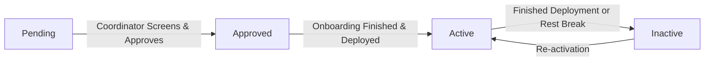

# NayePankh Volunteer Registration System

A premium, responsive, and end-to-end Volunteer Registration and Deployment System built for **NayePankh Foundation**—a youth-led Indian NGO (12A/80G registered) focused on food drives, menstrual hygiene awareness, clothing distribution, and education.

Designed with a custom flight-and-wing visual motif representing NayePankh's identity (*"new wings"*), this system handles public mobile-first volunteer onboarding and secure coordinator-led program matching.

---

## 🚀 Quick Start & Dual Modes

The system operates in a **dual mode** which enables immediate evaluation without any initial database configuration:

### 1. Portfolio Demo Mode (Default Fallback)
If no environment variables are defined, the app automatically runs in **Portfolio Demo Mode** utilizing a high-fidelity mock database built on `localStorage`.
*   **Seed Data**: Auto-populated with 12 diverse volunteer records (ranging from cities like Lucknow to Mumbai, spread across different statuses, causes, and sign-up dates over the last 4 months).
*   **Admin Access**: Clicking **Demo Auto-Login** on the Admin page will automatically log you in as an administrator to inspect the dashboard.
*   **Persistent**: All state changes, registrations, and status updates persist in your browser session.

### 2. Supabase Cloud Mode
To connect to a live Supabase PostgreSQL database and Auth server:
1. Create a `.env` file in the root directory:
   ```env
   VITE_SUPABASE_URL=YOUR_SUPABASE_URL
   VITE_SUPABASE_ANON_KEY=YOUR_SUPABASE_ANON_KEY
   ```
2. Run the database initialization script located in [schema.sql](file:///c:/Users/abhil/OneDrive/Desktop/nayePankh%20full%20stack%20project/schema.sql) using the Supabase SQL editor.
3. The application will detect the environment variables and switch to **Supabase Cloud Mode** automatically.

### Running Locally
To launch the development server:
```bash
npm install
npm run dev
```
To test the production build:
```bash
npm run build
```

---

## 📋 Data Model

The `volunteers` table tracks onboarding metrics:

| Field Name | Type | Description |
| :--- | :--- | :--- |
| `id` | `UUID` | Unique primary key (auto-generated). |
| `full_name` | `TEXT` | Volunteer's name. Checked to verify it is at least 2 characters. |
| `email` | `TEXT` | Unique email. Enforces format validation and prevents duplicate signups. |
| `phone` | `TEXT` | WhatsApp/Contact number (validated against 10-digit Indian formats). |
| `city` | `TEXT` | Active center in India (e.g. Lucknow, Delhi, Mumbai). |
| `causes` | `TEXT[]` | Multi-select array. Focus areas: `Food Drives`, `Menstrual Hygiene Awareness`, `Clothing Distribution`, `Education`. |
| `availability`| `TEXT` | Scheduling availability: `Weekdays`, `Weekends`, or `Both`. |
| `hours_per_week`| `INT` | Weekly hours commitment (1 to 50 hours). |
| `skills` | `TEXT` | Free-form description of skills (e.g., photography, teaching, logistics). |
| `status` | `TEXT` | Current pipeline state: `Pending` ➔ `Approved` ➔ `Active` ➔ `Inactive`. |
| `registered_at`| `TIMESTAMPTZ`| Timestamp of volunteer submission. |

### Why these fields exist:
*   **Causes**: Allows organizers to query specialized lists (e.g., retrieving only volunteers interested in `Menstrual Hygiene Awareness` to conduct a school workshop).
*   **City & Availability**: Ensures localized deployment. Food drives and clothing runs are hyper-local; knowing where a volunteer lives and when they are free prevents logistics friction.
*   **Skills**: Free-form text allows volunteers to mention specialized skills (e.g., photography, driving, or teaching) that organizers can search for using the search bar on the dashboard.

---

## 🔑 Design Decisions

### 1. Accountless Volunteers vs. Authenticated Organizers
*   **Volunteers do not need accounts**: Registration friction is the primary reason potential volunteers abandon signup forms. By removing password creation and email verification for volunteers, onboarding remains **zero-friction and mobile-first**.
*   **Only Organizers login**: Administrators manage personal identifiable information (PII) like phone numbers and emails. Supabase Auth gates access to the dashboard and analytics reports, preventing unauthorized public access to volunteer records.

### 2. The Status Pipeline as a Deliberate Workflow
Status is designed as a strict pipeline: **Pending ➔ Approved ➔ Active ➔ Inactive**



*   **Pending**: The initial state when a volunteer submits their form. It acts as an inbox.
*   **Approved**: Represents volunteers who have been screened, contacted, and added to NayePankh's regional mailing/WhatsApp lists.
*   **Active**: Volunteers currently deployed on active drives (e.g., teaching in an education center or distributing food).
*   **Inactive**: Volunteers taking a break or unavailable. They remain in the database to preserve historical data but are excluded from active mobilization queries.

The dashboard includes transition controls (`←` and `→` arrows) with confirmation modals. This forces organizers to deliberately move volunteers through these stages, ensuring volunteer coordination stays structured.

---

## 📈 Interactive Reports & CSV Export
*   **Custom SVG-based Charts**: All charts (cause distribution horizontal bar chart, area line graph showing sign-ups by month, and status breakdown progress bars) are custom React SVG components. This reduces load time by keeping dependencies minimal while providing smooth theme gradients and hover-sensitive tooltips.
*   **CSV Exporter**: Filters down the volunteer list dynamically based on search terms or categories, and lets the administrator download *only* that active view, making targeted email/sms campaigns fast and simple.

---

## 🔮 What I'd Add with More Time

1.  **Automated Notifications**: Integrate Twilio/SendGrid to trigger automated messages (e.g. an email saying *"Welcome to NayePankh! You have been Approved..."* or a WhatsApp ping when active food drives match their availability).
2.  **Drive/Event Management**: A calendar component where organizers can schedule food drives and directly assign `Active` volunteers, keeping scheduling inside a single portal.
3.  **Organizer Audit Logs**: Tracking which administrator moved a volunteer along the pipeline, along with transition notes (e.g., *"Moved Sneha to Active after successful onboarding call"*).
4.  **Skills Search Optimization**: Build a semantic text tag search index to parse free-form skills description into filterable tags.
